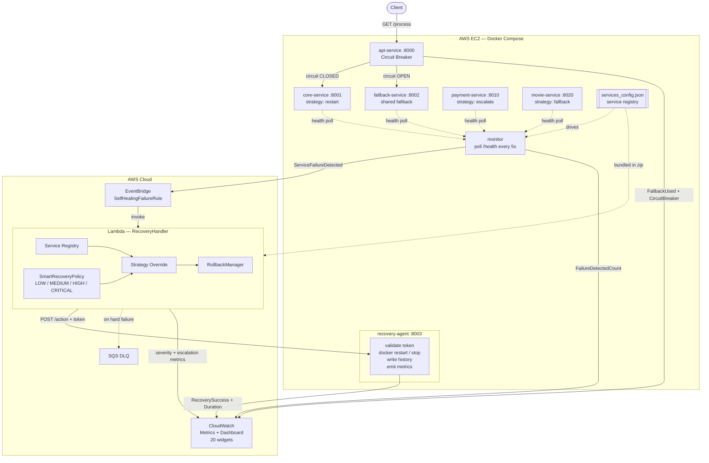
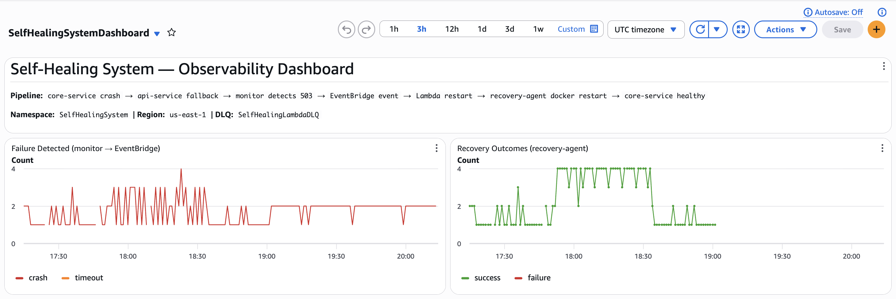
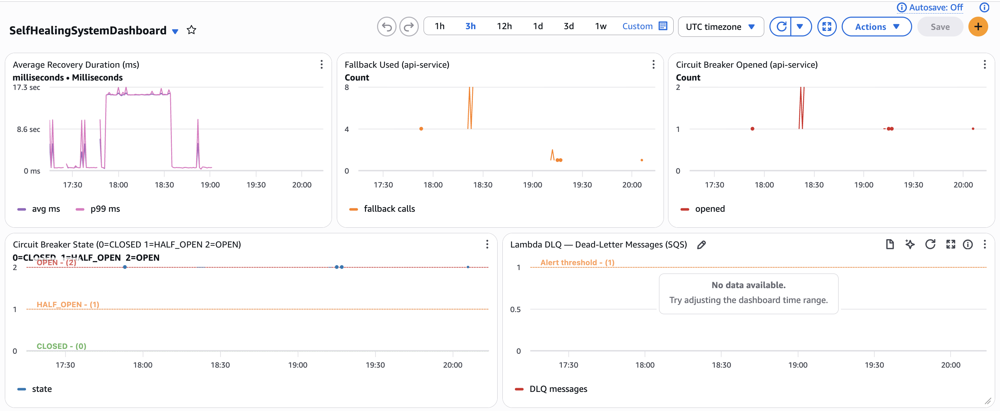
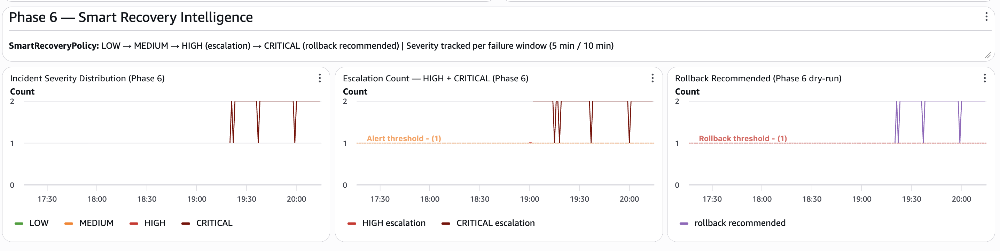
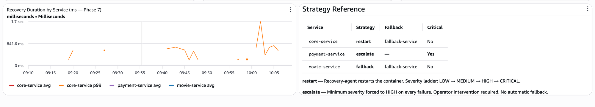

# Self-Healing Distributed System

> A production-grade distributed system that detects service failures, makes intelligent severity-aware recovery decisions through AWS Lambda, and restores full health — without human intervention. Phase 7 extends this to a **multi-service platform** where each service carries its own recovery strategy, defined in a central registry.


---

## Live Demo

> Deployed on AWS EC2 — `54.224.134.71`

| Service | URL | Description |
|---|---|---|
| **api-service** | `http://54.224.134.71:8000/process` | Primary entry point |
| **api-service health** | `http://54.224.134.71:8000/health` | Health check |
| **core-service health** | `http://54.224.134.71:8001/health` | Primary service (strategy: restart) |
| **fallback-service health** | `http://54.224.134.71:8002/health` | Shared fallback service |
| **payment-service health** | `http://54.224.134.71:8010/health` | Critical service (strategy: escalate) |
| **movie-service health** | `http://54.224.134.71:8020/health` | Catalog service (strategy: fallback) |

```bash
# Normal response
curl http://54.224.134.71:8000/process

# Trigger core-service crash → watch auto-recovery (restart strategy)
curl -X POST http://54.224.134.71:8001/fail
curl http://54.224.134.71:8000/process    # degraded=true (fallback active)
sleep 30
curl http://54.224.134.71:8000/process    # degraded=false (auto-recovered)

# Trigger payment-service crash → Lambda forces severity=HIGH (escalate strategy)
curl -X POST http://54.224.134.71:8010/fail

# Trigger movie-service crash → Lambda routes to fallback-service (fallback strategy)
curl -X POST http://54.224.134.71:8020/fail
```

> **Note:** The EC2 instance may be stopped to avoid AWS costs. If the above URLs are unreachable, refer to the [Setup Instructions](#setup-instructions) to run locally.

---

## Table of Contents

- [Live Demo](#live-demo)
- [Architecture Overview](#architecture-overview)
- [Phase Progression](#phase-progression)
- [Features](#features)
- [Tech Stack](#tech-stack)
- [System Workflow](#system-workflow)
- [Key Concepts](#key-concepts)
- [API Reference](#api-reference)
- [Project Structure](#project-structure)
- [Setup Instructions](#setup-instructions)
- [Testing the System](#testing-the-system)
- [CloudWatch Dashboard](#cloudwatch-dashboard)
- [Sample Outputs](#sample-outputs)
- [Future Improvements](#future-improvements)
- [Why This Project Matters](#why-this-project-matters)

---

## Architecture Overview



**End-to-end recovery time: ~5–30 seconds from crash detection to full health.**

---

## Phase Progression

This project was built incrementally across 7 phases, each adding a production-grade capability:

| Phase | What Was Built |
|---|---|
| **Phase 1** | Core microservices — api-service, core-service, fallback-service running in Docker Compose |
| **Phase 2** | Health monitor polling every 5s, detecting crashes and latency degradation |
| **Phase 3** | AWS EventBridge integration — monitor publishes failure events; Lambda receives and logs them |
| **Phase 4** | Lambda executes recovery — calls recovery-agent via HTTP to `docker restart` the failed container |
| **Phase 5** | Production hardening — circuit breaker, CloudWatch metrics, SQS DLQ, event cooldown, EC2 deployment |
| **Phase 6** | Advanced self-healing — SmartRecoveryPolicy, IncidentSeverity, escalation logic, RollbackManager, new CloudWatch widgets |
| **Phase 7** | Multi-service platform — `services_config.json` registry, per-service strategies (restart/escalate/fallback), payment-service and movie-service added as real-world examples, 20-widget dashboard |

---

## Features

| Feature | Phase | Description |
|---|---|---|
| **Auto Recovery** | 4 | Lambda triggers `docker restart` on failed services. No manual intervention. |
| **Circuit Breaker** | 5 | Three-state machine (CLOSED → OPEN → HALF_OPEN). Stops hammering a failing service. |
| **Fallback Handling** | 5 | api-service routes traffic to fallback-service while core-service recovers. |
| **Event Cooldown** | 5 | 60s deduplication window prevents Lambda from firing multiple times per incident. |
| **Secure Recovery** | 5 | `X-Recovery-Token` header + service allowlist protect recovery-agent from unauthorized calls. |
| **CloudWatch Metrics** | 5 | Custom metrics across all services. Real-time failure and recovery visibility. |
| **Recovery Audit Log** | 5 | Every action appended to `recovery_history.jsonl` — permanent append-only log. |
| **SQS Dead-Letter Queue** | 5 | Failed Lambda invocations captured for post-incident analysis. |
| **EC2 Deployment** | 5 | All Docker services deployed on AWS EC2, accessible over the internet. |
| **SmartRecoveryPolicy** | 6 | Decision engine mapping failure type + severity → correct recovery action. |
| **IncidentSeverity** | 6 | Four-tier classification: LOW / MEDIUM / HIGH / CRITICAL based on failure frequency. |
| **Escalation Logic** | 6 | Automatic escalation when failures exceed thresholds within sliding time windows. |
| **Action Override** | 6 | CRITICAL severity overrides restart → enable_fallback to stop the unstable container. |
| **RollbackManager** | 6 | Dry-run rollback recommendations logged when CRITICAL severity is reached. |
| **Severity Metrics** | 6 | Three new CloudWatch metrics: IncidentSeverityCount, EscalationCount, RollbackRecommendedCount. |
| **Service Registry** | 7 | `services_config.json` is the single source of truth — monitor, Lambda, and recovery-agent all load from it. Adding a new service requires zero code changes. |
| **Per-Service Strategy** | 7 | Each service declares its recovery strategy: `restart`, `escalate`, or `fallback`. Lambda applies the correct strategy automatically. |
| **Escalate Strategy** | 7 | Critical services with no fallback (payment-service) have every failure forced to minimum severity=HIGH. Operator intervention is always alerted. |
| **Fallback Strategy** | 7 | Services with a declared fallback (movie-service) log `FALLBACK_AVAILABLE` with the target service name on CRITICAL, enabling traffic routing. |
| **Multi-Service Dashboard** | 7 | 20-widget CloudWatch dashboard with Phase 7 section: per-service failures, recovery outcomes, severity, escalations, rollback, and duration broken down by service. |

---

## Tech Stack

| Layer | Technology |
|---|---|
| **Services** | Python 3.12, FastAPI, uvicorn |
| **Packaging** | Docker, Docker Compose |
| **Health Monitor** | Python (requests, boto3) — reads services_config.json dynamically |
| **Service Registry** | `services_config.json` — drives monitor, Lambda, and recovery-agent |
| **Event Bus** | AWS EventBridge |
| **Serverless Recovery** | AWS Lambda (Python 3.12) |
| **Decision Engine** | SmartRecoveryPolicy + strategy-aware overrides (Phase 7) |
| **Infrastructure** | AWS EC2 (t2.micro, Ubuntu 22.04) |
| **Dead-Letter Queue** | AWS SQS |
| **Observability** | AWS CloudWatch (custom metrics + 20-widget dashboard) |
| **Deployment** | AWS Systems Manager (SSM) send-command |
| **Configuration** | pydantic-settings (env-based) |
| **Testing** | pytest, 33-test suite (unit + integration) |

---

## System Workflow

### Normal Operation

```
Client ──► api-service ──► core-service ──► { "source": "core-service", "degraded": false }
```

### Failure → Auto-Recovery (8 steps)

```
Step 1   Client calls GET /process
         api-service tries core-service → returns 503 (crashed)

Step 2   Circuit Breaker opens after 3 consecutive failures
         api-service routes all traffic to fallback-service
         → { "source": "fallback-service", "degraded": true }

Step 3   Monitor detects HTTP 503 on core-service (5-second poll)
         Publishes event to AWS EventBridge:
         { "source": "selfhealing.monitor",
           "detail-type": "ServiceFailureDetected",
           "detail": { "service_name": "core-service", "failure_type": "crash" } }

Step 4   EventBridge rule matches → invokes Lambda
         Event cooldown prevents duplicate invocations for 60 seconds

Step 5   Lambda: loads services_config.json → looks up core-service strategy = "restart"
         SmartRecoveryPolicy evaluates severity:
         failure_count_5min=1 → LOW  → action = restart_service
         failure_count_5min=3 → HIGH → action = restart_service (+ escalation)
         failure_count_10min≥5→ CRITICAL → action = enable_fallback (action override)

Step 6   Lambda calls POST /action on recovery-agent with:
         { "action": "restart_service", "target_service": "core-service",
           "severity": "LOW", "recovery_strategy": "standard_restart" }

Step 7   recovery-agent validates token + executes docker restart core-service
         Writes record to recovery_history.jsonl
         Emits CloudWatch metrics: RecoverySuccess, IncidentSeverityCount

Step 8   core-service restarts and passes health check
         Circuit breaker probes (HALF_OPEN) → success → CLOSED
         api-service resumes: { "source": "core-service", "degraded": false }
         Monitor clears cooldown. System fully healed.
```

### Phase 7 — Strategy-Aware Multi-Service Recovery

The same pipeline applies to all registered services, but Lambda applies a different strategy depending on the service:

```
payment-service crash detected
       │
       ▼
Lambda: strategy = "escalate" (critical=true, no fallback)
       │
       ├── SmartRecoveryPolicy: severity=LOW (first failure)
       │
       └── Strategy override: LOW → HIGH (forced minimum for critical services)
           Logs: CRITICAL_SERVICE_NO_FALLBACK — operator intervention required
           Emits: EscalationCount metric with ServiceName=payment-service

movie-service crash detected
       │
       ▼
Lambda: strategy = "fallback", fallback_service = "fallback-service"
       │
       ├── SmartRecoveryPolicy: if severity=CRITICAL → action=enable_fallback
       │
       └── Logs: FALLBACK_AVAILABLE — traffic should route to fallback-service
           recovery-agent: docker stop movie-service (enable_fallback action)
```

### Circuit Breaker State Machine

```
          3 failures                  30s timer expires
CLOSED ─────────────────► OPEN ──────────────────────────► HALF_OPEN
  ▲                                                              │
  │              probe succeeds (1 request passes)              │
  └──────────────────────────────────────────────────────────────┘
                        probe fails → back to OPEN
```

### SmartRecoveryPolicy Decision Tree

```
Failure received
       │
       ├── failure_type = "slow"  ──────────────────────────► enable_fallback
       │                                                      (always, any severity)
       │
       └── failure_type = "crash" or "timeout"
                  │
                  ├── count_10min ≥ 5  → CRITICAL ──────────► enable_fallback
                  │                      is_escalated=True     (action override)
                  │
                  ├── count_5min  ≥ 3  → HIGH ───────────────► restart_service
                  │                      is_escalated=True     (+ escalation logged)
                  │
                  ├── count_5min  ≥ 2  → MEDIUM ─────────────► restart_service
                  │
                  └── count_5min  = 1  → LOW ───────────────► restart_service

Phase 7 overlay:
  strategy=escalate → minimum severity = HIGH regardless of failure count
  strategy=fallback  → on enable_fallback, logs FALLBACK_AVAILABLE with fallback service name
```

---

## Key Concepts

### Circuit Breaker

A safety switch between api-service and core-service that prevents cascading failures.

- **CLOSED** — normal state. Every request passes through to core-service.
- **OPEN** — tripped after 3 consecutive failures. All requests bypass core-service and go directly to fallback-service. This gives core-service time to recover without being hammered.
- **HALF_OPEN** — after 30 seconds in OPEN, one test request is allowed through. If it succeeds, the circuit closes. If it fails, the circuit reopens for another 30 seconds.

This pattern is equivalent to Netflix Hystrix or Java's Resilience4j, implemented from scratch in Python.

### Fallback

When core-service is unavailable (circuit OPEN or HTTP 503), api-service calls fallback-service instead. The response indicates degraded mode:

```json
{ "source": "fallback-service", "degraded": true, "message": "Service temporarily unavailable" }
```

The client always gets a response — never a 503 error — while the system heals in the background.

### Smart Recovery

The `SmartRecoveryPolicy` class inside Lambda replaces a static action map with severity-aware decision making. It uses module-level Python dicts that persist across warm Lambda invocations (no DynamoDB needed) to track failure history in 5-minute and 10-minute sliding windows.

```
1st crash in 5min  → LOW    → restart
2nd crash in 5min  → MEDIUM → restart
3rd crash in 5min  → HIGH   → restart + escalation alert
5th crash in 10min → CRITICAL → stop the container (enable_fallback)
```

At CRITICAL, the system recognizes that restarting a service that keeps crashing is futile — it stops the container and routes all traffic through fallback until a human intervenes.

### Service Registry (Phase 7)

`services_config.json` is the single source of truth for all services. Every component loads from it at startup:

- **Monitor** — dynamically builds the list of URLs to poll. Adding a new service to the registry immediately starts monitoring it — no code change needed.
- **Lambda** — loads the registry at module init (survives warm invocations). Reads each service's strategy, fallback target, and criticality.
- **Recovery-agent** — `ALLOWED_SERVICES` env var is driven by the registry, whitelisting which containers the agent is permitted to restart.

```json
{
  "service_name": "payment-service",
  "health_url": "http://localhost:8010/health",
  "container_name": "payment-service",
  "strategy": "escalate",
  "fallback_service": null,
  "critical": true
}
```

### Strategy-Aware Recovery (Phase 7)

Each service declares one of three strategies:

| Strategy | Behaviour | Example service |
|---|---|---|
| `restart` | Standard recovery. Severity ladder applies (LOW → CRITICAL). Falls back on CRITICAL. | core-service |
| `escalate` | Minimum severity = HIGH on every failure. For critical services with no fallback — operator must be notified every time. | payment-service |
| `fallback` | Same as restart, but logs `FALLBACK_AVAILABLE` with the named fallback service on CRITICAL. Enables traffic routing. | movie-service |

### Rollback Manager

The `RollbackManager` class tracks the last-known-good image tag for each service. When severity reaches CRITICAL, it logs a `ROLLBACK_RECOMMENDED` event with the image reference:

```
ROLLBACK_RECOMMENDED: service=core-service  image=core-service:latest  (dry-run)
```

The recommendation is logged and emitted as a CloudWatch metric but not executed — a human or automation pipeline can act on it.

---

## API Reference

### api-service — Port 8000 (Public Gateway)

| Method | Endpoint | Description | Response |
|---|---|---|---|
| `GET` | `/health` | Service health check | `{"status": "healthy", "service": "api-service"}` |
| `GET` | `/process` | Main entry point — calls core-service, falls back to fallback-service on failure | `{"source": "core-service", "degraded": false}` |

### core-service — Port 8001 (Primary Worker)

| Method | Endpoint | Description | Response |
|---|---|---|---|
| `GET` | `/health` | Returns 503 when crashed | `{"status": "healthy"/"unhealthy", "service": "core-service"}` |
| `GET` | `/work` | Business logic endpoint called by api-service | `{"message": "...", "service": "core-service"}` |
| `GET` | `/slow` | Simulates high latency response | `{"message": "...", "latency_simulated_seconds": 5.0}` |
| `POST` | `/fail` | **Test only** — triggers a crash | `{"crashed": true}` |
| `POST` | `/slow-mode` | **Test only** — activates slow mode on `/work` | `{"message": "slow mode enabled"}` |
| `POST` | `/recover` | Manually resets all failure flags | `{"crashed": false}` |

### fallback-service — Port 8002 (Degraded Mode)

| Method | Endpoint | Description | Response |
|---|---|---|---|
| `GET` | `/health` | Service health check | `{"status": "healthy", "service": "fallback-service"}` |
| `GET` | `/fallback` | Returns degraded response (called by api-service when circuit is OPEN) | `{"message": "...", "degraded": true}` |

### recovery-agent — Port 8003 (Recovery Executor)

| Method | Endpoint | Auth | Description |
|---|---|---|---|
| `GET` | `/health` | None | Health check (token-free for load balancers) |
| `POST` | `/action` | `X-Recovery-Token` header required | Executes Docker recovery command |

**POST `/action` request body:**

```json
{
  "action": "restart_service | enable_fallback | disable_fallback",
  "target_service": "core-service",
  "reason": "crash detected",
  "severity": "LOW | MEDIUM | HIGH | CRITICAL",
  "recovery_strategy": "standard_restart | fallback_on_critical",
  "failure_count": 1,
  "escalation_reason": null
}
```

**POST `/action` response:**

```json
{
  "success": true,
  "action": "restart_service",
  "target_service": "core-service",
  "message": "Container 'core-service' restarted successfully.",
  "timestamp": "2026-04-28T10:00:00.000000+00:00",
  "command_result": {
    "success": true,
    "stdout": "core-service",
    "stderr": "",
    "returncode": 0
  }
}
```

### payment-service — Port 8010 (Critical Service — Phase 7 Example)

> Strategy: `escalate` — critical=true, no fallback. Every failure triggers minimum severity=HIGH.

| Method | Endpoint | Description | Response |
|---|---|---|---|
| `GET` | `/health` | Returns 503 when crashed | `{"status": "healthy"/"unhealthy", "service": "payment-service"}` |
| `GET` | `/process-payment` | Simulated payment processing | `{"message": "Payment processed", "service": "payment-service"}` |
| `POST` | `/fail` | **Test only** — triggers a crash | `{"crashed": true}` |
| `POST` | `/recover` | Manually resets failure flag | `{"crashed": false}` |

### movie-service — Port 8020 (Fallback Strategy — Phase 7 Example)

> Strategy: `fallback` — on CRITICAL, Lambda logs FALLBACK_AVAILABLE and routes to fallback-service.

| Method | Endpoint | Description | Response |
|---|---|---|---|
| `GET` | `/health` | Returns 503 when crashed | `{"status": "healthy"/"unhealthy", "service": "movie-service"}` |
| `GET` | `/catalog` | Returns movie catalog | `{"movies": [...], "service": "movie-service"}` |
| `POST` | `/fail` | **Test only** — triggers a crash | `{"crashed": true}` |
| `POST` | `/recover` | Manually resets failure flag | `{"crashed": false}` |

---

## Project Structure

```
self-healing-system/
│
├── services_config.json               # Phase 7: single source of truth for all services
│                                      # drives monitor URL list, Lambda strategy, agent allowlist
│
├── api-service/                       # Entry point for client traffic (:8000)
│   └── app/
│       ├── services/
│       │   ├── api_service.py         # try core → fallback logic
│       │   └── circuit_breaker.py     # CLOSED/OPEN/HALF_OPEN state machine
│       └── publishers/
│           └── cloudwatch_publisher.py
│
├── core-service/                      # Primary business logic (:8001) — strategy: restart
│   └── app/
│       ├── routes/core_routes.py      # GET /work, POST /fail, GET /health
│       └── services/state_manager.py  # crashed/healthy state
│
├── fallback-service/                  # Degraded-mode backup (:8002) — shared fallback
│
├── payment-service/                   # Phase 7 example (:8010) — strategy: escalate
│   └── app/
│       ├── routes/routes.py           # GET /process-payment, POST /fail, GET /health
│       └── services/
│           ├── payment_service.py     # payment processing logic
│           └── state_manager.py       # crashed/healthy state
│
├── movie-service/                     # Phase 7 example (:8020) — strategy: fallback
│   └── app/
│       ├── routes/routes.py           # GET /catalog, POST /fail, GET /health
│       └── services/
│           ├── movie_service.py       # catalog logic (5 movies)
│           └── state_manager.py       # crashed/healthy state
│
├── recovery-agent/                    # Executes Docker commands (:8003)
│   └── app/
│       ├── services/
│       │   ├── recovery_service.py    # restart / stop / start logic
│       │   └── recovery_history.py    # append-only JSONL audit log
│       ├── models/schemas.py          # ActionRequest with Phase 6/7 fields
│       └── publishers/
│           └── cloudwatch_publisher.py
│
├── monitor/                           # Health + latency monitor
│   ├── monitor.py                     # Phase 7: loads services_config.json dynamically
│   └── app/
│       ├── checkers/
│       │   ├── health_checker.py      # HTTP /health polling every 5s
│       │   └── latency_checker.py     # SLOW / VERY_SLOW classification
│       ├── config/settings.py         # services_config_path + feature flags
│       ├── publishers/
│       │   ├── eventbridge_publisher.py
│       │   └── cloudwatch_publisher.py
│       └── services/
│           ├── monitor_service.py     # Main loop + cooldown logic
│           └── event_cooldown.py      # 60s deduplication window
│
├── aws/
│   ├── lambda/
│   │   ├── recovery_handler.py        # Phase 7: strategy-aware, loads service registry
│   │   ├── smart_recovery_policy.py   # IncidentSeverity + decision engine
│   │   ├── rollback_manager.py        # Dry-run rollback recommendations
│   │   └── tests/
│   │       ├── conftest.py
│   │       ├── test_smart_recovery_policy.py  # 18 unit tests
│   │       └── test_rollback_manager.py       # 15 unit tests
│   ├── cloudwatch/
│   │   ├── dashboard.json             # 20-widget CloudWatch dashboard (Phase 7)
│   │   └── create_dashboard.sh
│   └── setup/
│       ├── eventbridge_rule.json
│       └── iam_policy.json
│
├── tests/
│   └── scripts/
│       ├── critical_core_failure_recovery.sh  # End-to-end chaos test
│       └── verify_cloudwatch_metrics.sh
│
├── docker-compose.yml                 # All 6 services: api, core, fallback, agent, payment, movie
├── .env.example
└── docs/
    ├── screenshots/
    │   ├── dashboard-overview.png
    │   ├── recovery-pipeline.png
    │   └── incident-intelligence.png
    └── phase5-ec2-deployment.md
```

---

## Setup Instructions

### Prerequisites

| Tool | Version | Check |
|---|---|---|
| Docker + Docker Compose | v2+ | `docker compose version` |
| Python | 3.10+ | `python3 --version` |
| AWS CLI | v2 | `aws --version` |
| AWS account | — | Access key + secret configured |

### AWS Resources Required

| Resource | Name |
|---|---|
| Lambda Function | `SelfHealingRecoveryHandler` |
| Lambda IAM Role | Needs: `lambda:InvokeFunction`, `cloudwatch:PutMetricData` |
| EventBridge Rule | `SelfHealingFailureRule` |
| SQS Dead-Letter Queue | `SelfHealingLambdaDLQ` |
| CloudWatch Dashboard | `SelfHealingSystemDashboard` |
| EC2 Instance | Ubuntu 22.04, ports 8000–8003, 8010, 8020 open |

---

### Option A — Local (Docker Compose)

```bash
# 1. Clone
git clone https://github.com/agrawal-2005/self-healing-system.git
cd self-healing-system

# 2. Start all 6 services (core, fallback, api, agent, payment, movie)
docker compose up --build -d
docker compose ps   # all 6 should show (healthy)

# 3. Configure AWS credentials
cp .env.example monitor/.env
# Edit monitor/.env:
#   AWS_ACCESS_KEY_ID=...
#   AWS_SECRET_ACCESS_KEY=...
#   AWS_DEFAULT_REGION=us-east-1

# 4. Start the monitor (reads services_config.json automatically)
cd monitor
python3 -m venv .venv && source .venv/bin/activate
pip install -r requirements.txt
python3 monitor.py > /tmp/monitor.log 2>&1 &
cd ..

# 5. Deploy Lambda (Phase 7 — all 4 files + registry required)
cd aws/lambda
cp ../../services_config.json .
zip recovery_handler.zip recovery_handler.py smart_recovery_policy.py rollback_manager.py services_config.json

aws lambda update-function-code \
  --function-name SelfHealingRecoveryHandler \
  --zip-file fileb://recovery_handler.zip \
  --region us-east-1

# 6. Configure Lambda environment
aws lambda update-function-configuration \
  --function-name SelfHealingRecoveryHandler \
  --environment "Variables={
    RECOVERY_AGENT_URL=http://<YOUR_EC2_OR_NGROK_URL>:8003,
    TARGET_SERVICE=core-service,
    RECOVERY_TOKEN=dev-token,
    MAX_RETRIES=3,
    IMAGE_TAG=latest,
    CLOUDWATCH_ENABLED=true,
    CLOUDWATCH_NAMESPACE=SelfHealingSystem
  }" \
  --region us-east-1
```

---

### Option B — EC2 Deployment (Production)

All services run on an EC2 instance. Deployment uses AWS Systems Manager (SSM) — no SSH keys required.

```bash
# 1. Set your EC2 instance ID
INSTANCE_ID="i-xxxxxxxxxxxxxxxxx"
EC2="<your-ec2-public-ip>"

# 2. Deploy latest code via SSM
aws ssm send-command \
  --instance-ids "$INSTANCE_ID" \
  --document-name "AWS-RunShellScript" \
  --parameters "{\"commands\":[
    \"chown -R ubuntu:ubuntu /home/ubuntu/self-healing-system\",
    \"sudo -u ubuntu bash -c 'cd /home/ubuntu/self-healing-system && git pull origin main'\",
    \"docker compose up --build -d --wait\"
  ]}" \
  --region us-east-1

# 3. Verify all 6 services are healthy
curl http://$EC2:8000/health    # api-service
curl http://$EC2:8001/health    # core-service
curl http://$EC2:8002/health    # fallback-service
curl http://$EC2:8003/health    # recovery-agent
curl http://$EC2:8010/health    # payment-service
curl http://$EC2:8020/health    # movie-service

# 4. Restart monitor to pick up latest services_config.json
aws ssm send-command \
  --instance-ids "$INSTANCE_ID" \
  --document-name "AWS-RunShellScript" \
  --parameters "{\"commands\":[
    \"pkill -f 'python3 monitor.py' || true\",
    \"sudo -u ubuntu bash -c 'cd /home/ubuntu/self-healing-system/monitor && source .venv/bin/activate && nohup python3 monitor.py > /home/ubuntu/monitor.log 2>&1 &'\"
  ]}" \
  --region us-east-1

# 5. Deploy Lambda pointing to EC2
aws lambda update-function-configuration \
  --function-name SelfHealingRecoveryHandler \
  --environment "Variables={
    RECOVERY_AGENT_URL=http://$EC2:8003,
    TARGET_SERVICE=core-service,
    RECOVERY_TOKEN=dev-token,
    MAX_RETRIES=3,
    CLOUDWATCH_ENABLED=true,
    CLOUDWATCH_NAMESPACE=SelfHealingSystem
  }" \
  --region us-east-1
```

---

## Testing the System

### Unit Tests (Lambda)

```bash
cd aws/lambda
python -m pytest tests/ -v

# Expected output:
# tests/test_smart_recovery_policy.py::test_first_failure_is_low_severity PASSED
# tests/test_smart_recovery_policy.py::test_high_severity_escalation PASSED
# tests/test_smart_recovery_policy.py::test_critical_overrides_action_to_fallback PASSED
# tests/test_rollback_manager.py::test_recommend_rollback_on_critical PASSED
# ... 33 tests passed
```

### End-to-End Chaos Test

```bash
# Against local
chmod +x tests/scripts/critical_core_failure_recovery.sh
./tests/scripts/critical_core_failure_recovery.sh

# Against EC2
EC2=<your-ec2-ip> ./tests/scripts/critical_core_failure_recovery.sh
```

### Manual Tests

#### Test 1 — Verify baseline

```bash
curl http://$EC2:8000/process
# { "source": "core-service", "degraded": false }
```

#### Test 2 — Trigger a crash (restart strategy)

```bash
curl -X POST http://$EC2:8001/fail
# { "crashed": true }
```

#### Test 3 — Observe fallback immediately

```bash
curl http://$EC2:8000/process
# { "source": "fallback-service", "degraded": true }
```

#### Test 4 — Confirm full recovery

```bash
sleep 30
curl http://$EC2:8000/process
# { "source": "core-service", "degraded": false }
```

#### Test 5 — Phase 6 escalation demo (5 crashes, 65s apart)

```bash
for i in 1 2 3 4 5; do
  curl -s -X POST http://$EC2:8001/fail
  echo "Crash $i triggered"
  sleep 65
done
# Crash 5 → CRITICAL severity → enable_fallback + ROLLBACK_RECOMMENDED
```

#### Test 6 — Phase 7: payment-service escalate strategy

```bash
# First failure on payment-service — Lambda forces HIGH (not LOW)
curl -X POST http://$EC2:8010/fail

# Check Lambda logs for: CRITICAL_SERVICE_NO_FALLBACK
# Severity will be HIGH on the very first failure (escalate strategy)
```

#### Test 7 — Phase 7: movie-service fallback strategy

```bash
# Trigger movie-service CRITICAL (5 crashes)
for i in 1 2 3 4 5; do
  curl -s -X POST http://$EC2:8020/fail
  echo "Movie crash $i"
  sleep 65
done
# On CRITICAL → Lambda logs: FALLBACK_AVAILABLE: movie-service → fallback-service
```

#### Test 8 — Phase 7: simultaneous multi-service failure

```bash
# Crash all three services at the same time
curl -X POST http://$EC2:8001/fail &   # core-service
curl -X POST http://$EC2:8010/fail &   # payment-service
curl -X POST http://$EC2:8020/fail &   # movie-service
wait

# Each service triggers a separate EventBridge event → separate Lambda invocation
# Lambda applies: restart (core), escalate→HIGH (payment), fallback (movie)
# All three recover independently
```

---

## CloudWatch Dashboard

Dashboard name: `SelfHealingSystemDashboard`  
Namespace: `SelfHealingSystem`

### Live Dashboard Screenshots

**Failure Detection & Recovery Outcomes**

> Real-time view of crash detection (red) and automated recovery (green) across a 3-hour test window. Every failure spike on the left has a matching success spike on the right — the system self-healed every single time.

**Recovery Pipeline Metrics**

> Recovery duration peaked at 17.3s during load testing, fallback activated up to 8 times, and the circuit breaker stayed OPEN while the service was unstable. Lambda DLQ shows no data — Lambda never hard-failed across the entire test.

**Incident Intelligence — Phase 6**

> SmartRecoveryPolicy in action: CRITICAL escalations firing above the alert threshold, and rollback recommendations triggered above the rollback threshold. All 3 widgets confirm the severity escalation ladder (LOW → MEDIUM → HIGH → CRITICAL) worked as designed.

**Service Recovery Strategies**

> Recovery duration breakdown per service alongside the strategy reference table. Each service carries a distinct recovery strategy: core-service restarts automatically (peaking at 1.7s), payment-service always escalates to minimum HIGH severity with no fallback, and movie-service routes to fallback-service on CRITICAL. The chart confirms only core-service has active recovery events — payment-service and movie-service lines appear when those services are exercised.

---

### All 20 Widgets Explained

#### Phase 1–5 Widgets

| Widget | Metric | What It Shows |
|---|---|---|
| **Failure Detected** | `FailureDetectedCount` | Each spike = one crash/timeout detected by monitor and sent to EventBridge. Dimension: `failure_type`. |
| **Recovery Outcomes** | `RecoverySuccessCount` / `RecoveryFailureCount` | Green = successful docker restart. Red = docker command failed. |
| **Average Recovery Duration** | `RecoveryDurationMs` | Time in ms from Lambda invocation to docker command completing. |
| **Fallback Used** | `FallbackUsedCount` | Each dot = one request served by fallback-service instead of core-service. |
| **Circuit Breaker Opened** | `CircuitBreakerOpenCount` | Each dot = circuit transitioned to OPEN. Frequent openings = persistent instability. |
| **Circuit Breaker State** | `CircuitBreakerState` | Gauge: 0=CLOSED (healthy), 1=HALF_OPEN (probing), 2=OPEN (all traffic on fallback). |
| **Lambda DLQ** | SQS `ApproximateNumberOfMessagesVisible` | Messages = Lambda hard-crashed. Zero = Lambda always handled events successfully. |

#### Phase 6 Widgets

| Widget | Metric | What It Shows |
|---|---|---|
| **Incident Severity Distribution** | `IncidentSeverityCount` | Lines per severity tier (LOW/MEDIUM/HIGH/CRITICAL). Shows whether failures are isolated or a pattern. |
| **Escalation Count** | `EscalationCount` | Published only for HIGH and CRITICAL severity. Spikes = system identified a persistent incident. |
| **Rollback Recommended** | `RollbackRecommendedCount` | Published when CRITICAL + baseline exists. Each count = one rollback recommendation logged. |

#### Phase 7 Widgets (Multi-Service)

| Widget | What It Shows |
|---|---|
| **Failures Detected by Service** | All 3 services on one chart — core-service, payment-service, movie-service. Isolates which service is failing. |
| **Recovery Outcomes by Service** | Success/failure lines per service. Compare recovery rates across strategies. |
| **Incident Severity by Service** | Severity breakdown per service. payment-service should only show HIGH/CRITICAL due to escalate strategy. |
| **Escalations by Service** | payment-service appears on every single failure it has. core-service only appears after 3+ failures. |
| **Rollback Recommended by Service** | Per-service rollback triggers. payment-service rollbacks are more frequent due to forced HIGH severity. |
| **Recovery Duration by Service** | avg + p99 per service. Compares restart speed vs enable_fallback speed across strategies. |
| **Strategy Reference** | Static table — core=restart, payment=escalate (critical, no fallback), movie=fallback (→ fallback-service). |

---

### Custom Metrics Reference

| Metric | Emitted By | Dimensions |
|---|---|---|
| `FailureDetectedCount` | monitor | `ServiceName`, `FailureType` |
| `FallbackUsedCount` | api-service | `ServiceName` |
| `CircuitBreakerOpenCount` | api-service | `ServiceName` |
| `CircuitBreakerState` | api-service | `ServiceName` |
| `RecoverySuccessCount` | recovery-agent | `ServiceName`, `TargetService`, `Action` |
| `RecoveryFailureCount` | recovery-agent | `ServiceName`, `TargetService`, `Action` |
| `RecoveryDurationMs` | recovery-agent | `ServiceName`, `TargetService`, `Action` |
| `IncidentSeverityCount` | Lambda | `ServiceName`, `Severity` |
| `EscalationCount` | Lambda | `ServiceName`, `Severity` |
| `RollbackRecommendedCount` | Lambda | `ServiceName` |

### Suggested Alarms

```bash
# Alert if any recovery failure occurs
aws cloudwatch put-metric-alarm \
  --alarm-name "RecoveryFailed" \
  --namespace SelfHealingSystem \
  --metric-name RecoveryFailureCount \
  --statistic Sum --period 300 --threshold 1 \
  --comparison-operator GreaterThanOrEqualToThreshold \
  --evaluation-periods 1 \
  --alarm-actions <YOUR_SNS_ARN> \
  --region us-east-1

# Alert on CRITICAL escalation for any service
aws cloudwatch put-metric-alarm \
  --alarm-name "CriticalEscalation" \
  --namespace SelfHealingSystem \
  --metric-name EscalationCount \
  --dimensions Name=Severity,Value=CRITICAL \
  --statistic Sum --period 300 --threshold 1 \
  --comparison-operator GreaterThanOrEqualToThreshold \
  --evaluation-periods 1 \
  --alarm-actions <YOUR_SNS_ARN> \
  --region us-east-1

# Alert specifically when payment-service escalates (critical service)
aws cloudwatch put-metric-alarm \
  --alarm-name "PaymentServiceEscalation" \
  --namespace SelfHealingSystem \
  --metric-name EscalationCount \
  --dimensions Name=ServiceName,Value=payment-service Name=Severity,Value=HIGH \
  --statistic Sum --period 60 --threshold 1 \
  --comparison-operator GreaterThanOrEqualToThreshold \
  --evaluation-periods 1 \
  --alarm-actions <YOUR_SNS_ARN> \
  --region us-east-1
```

---

## Sample Outputs

### Monitor log — Phase 7 multi-service healthy

```
2026-04-28 10:01:57 [monitor] INFO: [OK] core-service      status=UP   latency=2.9ms
2026-04-28 10:01:57 [monitor] INFO: [OK] payment-service   status=UP   latency=2.9ms
2026-04-28 10:01:57 [monitor] INFO: [OK] movie-service     status=UP   latency=2.7ms
2026-04-28 10:01:57 [monitor] INFO: All 3/3 services healthy
```

### Monitor log — during a recovery cycle

```
2026-04-28 10:02:02 [monitor] ERROR: HealthChecker [core-service]: DOWN — Connection refused
2026-04-28 10:02:02 [monitor] INFO:  EventBridgePublisher: published event service=core-service failure=crash
2026-04-28 10:02:08 [monitor] INFO:  EventCooldown: cleared 1 timer(s) for 'core-service' on recovery
2026-04-28 10:02:08 [monitor] INFO:  [OK] core-service     status=UP   latency=3.4ms
2026-04-28 10:02:08 [monitor] INFO:  All 3/3 services healthy
```

### Lambda log — Phase 7 payment-service (escalate strategy)

```
STRATEGY: service=payment-service  strategy=escalate  fallback=None  critical=True
SmartRecoveryPolicy: action=restart_service  severity=LOW  count_5m=1  escalated=False
CRITICAL_SERVICE_NO_FALLBACK: payment-service has no fallback — upgrading severity LOW → HIGH
lambda_handler: complete — service=payment-service  strategy=escalate  success=True
  severity=HIGH  duration=312ms  attempts=1  escalated=True  rollback=False
```

### Lambda log — Phase 7 movie-service (fallback strategy, CRITICAL)

```
STRATEGY: service=movie-service  strategy=fallback  fallback=fallback-service  critical=False
SmartRecoveryPolicy: action=enable_fallback  severity=CRITICAL  count_5m=4  count_10m=5
FALLBACK_AVAILABLE: movie-service is CRITICAL — traffic should route to fallback-service
lambda_handler: complete — service=movie-service  strategy=fallback  success=True
  severity=CRITICAL  duration=287ms  attempts=1  escalated=True  rollback=True
```

### Lambda log — Phase 6 CRITICAL escalation

```
SmartRecoveryPolicy: action=enable_fallback  severity=CRITICAL  strategy=fallback_on_critical  count_5m=4  count_10m=5
ESCALATION: core-service failed 5x in 10 min — service is critically unstable — switching to enable_fallback
ROLLBACK_RECOMMENDED: service=core-service  image=core-service:latest  (dry-run)
lambda_handler: complete — success=True  severity=CRITICAL  duration=241ms  attempts=1  escalated=True  rollback=True
```

### recovery-agent log

```
2026-04-28 10:00:06 [recovery_service] INFO: action=restart_service  target=core-service  severity=LOW
2026-04-28 10:00:06 [docker_executor]  INFO: running docker restart core-service
2026-04-28 10:00:07 [recovery_history] INFO: recorded action=restart_service  service=core-service  success=True  duration=520ms
```

### Recovery history record (`recovery_history.jsonl`)

```json
{
  "timestamp": "2026-04-28T10:00:06.361801+00:00",
  "service_name": "core-service",
  "failure_type": "crash",
  "action": "restart_service",
  "success": true,
  "message": "Container 'core-service' restarted successfully.",
  "recovery_duration_ms": 520.34,
  "returncode": 0,
  "severity": "LOW",
  "failure_count": 1,
  "recovery_strategy": "standard_restart",
  "escalation_reason": null
}
```

### Phase 7 payment-service record

```json
{
  "timestamp": "2026-04-28T10:05:00.000000+00:00",
  "service_name": "payment-service",
  "failure_type": "crash",
  "action": "restart_service",
  "success": true,
  "message": "Container 'payment-service' restarted successfully.",
  "recovery_duration_ms": 312.45,
  "returncode": 0,
  "severity": "HIGH",
  "failure_count": 1,
  "recovery_strategy": "standard_restart",
  "escalation_reason": "ESCALATION: payment-service is a critical service with no fallback — severity forced to HIGH on every failure"
}
```

### Circuit breaker log progression

```
WARNING: CircuitBreaker: failure recorded 1/3
WARNING: CircuitBreaker: failure recorded 2/3
WARNING: CircuitBreaker: CLOSED → OPEN (failures=3/3 threshold=3)
INFO:    FALLBACK_TRIGGERED: source=circuit_open
INFO:    CloudWatch: CircuitBreakerOpenCount+1  CircuitBreakerState=2
WARNING: CircuitBreaker: OPEN — blocking core-service call (29s until probe)
INFO:    CircuitBreaker: OPEN → HALF_OPEN after 30s cooldown
INFO:    CircuitBreaker: HALF_OPEN → CLOSED (core-service recovered)
```

### Chaos test result

```
══════════════════════════════════════════════════════════════════
  TEST SUMMARY: critical_core_failure_recovery
══════════════════════════════════════════════════════════════════

  Total steps checked : 31
  Passed              : 31
  Failed              : 0

  ██████████████████████████████████████████
    RESULT: PASS — All steps completed
    Self-healing pipeline is working
  ██████████████████████████████████████████
```

---

## Future Improvements

| Improvement | Description |
|---|---|
| **ECS / Fargate deployment** | Replace Docker Compose with ECS tasks. Remove direct EC2 access — recovery-agent runs inside the same VPC as Lambda, eliminating token-over-HTTP security concerns. |
| **Auto rollback execution** | Phase 7 logs rollback recommendations (dry-run). A future phase would execute `docker pull <previous-tag>` + container replacement when recovery fails after N retries. |
| **AI-based anomaly detection** | Replace threshold-based latency checks with a time-series model (e.g. AWS Lookout for Metrics) that detects statistical anomalies without fixed thresholds. |
| **Multi-region failover** | Replicate the EventBridge → Lambda → recovery pipeline across two regions. Promote secondary on primary failure. |
| **Slack / PagerDuty alerts** | Wire CloudWatch alarms → SNS → Lambda → Slack webhook. On-call engineers receive a message with recovery status and severity within seconds of detection. Especially important for `escalate` strategy services. |
| **DynamoDB failure history** | Replace module-level in-memory failure tracking with DynamoDB for persistence across cold Lambda starts and multi-Lambda deployments. |
| **Recovery runbooks** | Store runbooks in S3. Lambda fetches the correct runbook for each `failure_type`, enabling service-specific recovery procedures beyond restart/fallback. |
| **Chaos engineering suite** | Extend with slow-response, OOM, and partial-failure scenarios using `tc` (traffic control) or Pumba for realistic fault injection across all registered services. |
| **Dynamic strategy updates** | Hot-reload `services_config.json` from S3 on each Lambda invocation so strategy changes take effect without redeploying the Lambda zip. |

---

## Why This Project Matters

Modern distributed systems fail. Databases go down, pods crash, deployments introduce regressions. The standard response is human: an on-call engineer wakes up at 3 AM, reads logs, and runs `kubectl rollout restart`. That loop takes minutes.

This project compresses that loop to seconds — and makes the decisions smarter.

The architecture mirrors patterns used in production at large-scale engineering organizations:

- **Netflix Hystrix / Resilience4j** — circuit breakers protecting service meshes from cascading failures
- **AWS Auto Scaling** — health-check-driven replacement of unhealthy instances
- **Kubernetes liveness probes + restart policies** — container-level automatic recovery
- **PagerDuty + runbook automation** — event-driven remediation without human toil
- **Progressive severity escalation** — the same pattern used by major incident management platforms (PagerDuty, OpsGenie) to route alerts to the right responder at the right urgency level
- **Service mesh policy (Istio/Linkerd)** — per-service traffic management policies, mirrored here as per-service recovery strategies in the registry

The difference is that this system is fully observable, fully tested, and demonstrates these patterns end-to-end in a real AWS environment. Every component — the circuit breaker state machine, the event cooldown, the severity-based decision engine, the strategy-aware service registry, the token-authenticated recovery agent, the 20-widget CloudWatch dashboard — is a simplified but structurally faithful implementation of what runs in real production infrastructure.

For an SRE or DevOps engineer, this is a working demonstration of **toil reduction**: turning reactive firefighting into proactive, automated, and escalation-aware recovery across an entire service fleet.

---

## Author

**Prashant Agrawal**

[](https://github.com/agrawal-2005)

---

## License

This project is licensed under the **MIT License** — see the [LICENSE](LICENSE) file for details.

---

<p align="center">Star this repo if it helped you understand self-healing infrastructure patterns.</p>

<p align="center">Built to demonstrate production-grade SRE patterns: circuit breaking, intelligent escalation, strategy-aware recovery, and multi-service observability.</p>
