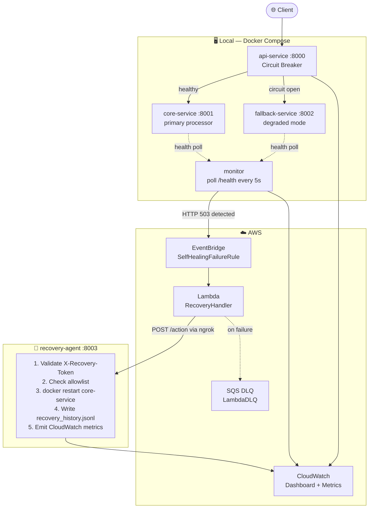

# Self-Healing Microservices System

> A production-grade distributed system that detects service failures, triggers automated recovery through AWS Lambda, and restores full health — without human intervention.


---

## Table of Contents

- [Architecture Overview](#architecture-overview)
- [Features](#features)
- [Tech Stack](#tech-stack)
- [How It Works](#how-it-works)
- [Project Structure](#project-structure)
- [Setup](#setup)
- [Testing the System](#testing-the-system)
- [CloudWatch Observability](#cloudwatch-observability)
- [Sample Output](#sample-output)
- [Future Improvements](#future-improvements)
- [Why This Project Matters](#why-this-project-matters)

---

## Architecture Overview



**End-to-end recovery time: ~5–30 seconds from crash detection to full health.**

---

## Features

| Feature | Description |
|---|---|
| 🔁 **Auto Recovery** | Lambda triggers `docker restart` on failed services. No manual intervention. |
| ⚡ **Circuit Breaker** | Three-state machine (CLOSED → OPEN → HALF_OPEN). Stops hammering a failing service. |
| 🛡 **Fallback Handling** | api-service switches to fallback-service while core-service recovers. |
| 🔕 **Event Cooldown** | Deduplication window (60s) prevents Lambda from being invoked multiple times per incident. |
| 🔐 **Secure Recovery** | Shared token (`X-Recovery-Token`) + service allowlist guard recovery-agent from unauthorized calls. |
| 📊 **CloudWatch Metrics** | 6 custom metrics across 3 services. Real-time visibility into failures and recovery. |
| 📋 **Recovery History** | Every action appended to `recovery_history.jsonl` — a permanent audit log. |
| 🧪 **Automated Tests** | End-to-end chaos test script. 31-step PASS/FAIL validation of the full pipeline. |
| ☁️ **SQS Dead-Letter Queue** | Failed Lambda invocations captured for post-incident analysis. |

---

## Tech Stack

| Layer | Technology |
|---|---|
| Services | Python 3.12, FastAPI, uvicorn |
| Packaging | Docker, Docker Compose |
| Health Monitor | Python (requests, boto3) |
| Event Bus | AWS EventBridge |
| Serverless Recovery | AWS Lambda (Python 3.12) |
| Dead-Letter Queue | AWS SQS |
| Observability | AWS CloudWatch (custom metrics + dashboard) |
| Tunnel | ngrok (Lambda → local recovery-agent) |
| Configuration | pydantic-settings (env-based) |

---

## How It Works

### Normal State

```
Client ──► api-service ──► core-service ──► response (degraded=false)
```

### Failure → Auto-Recovery (7 steps)

```
Step 1  Client calls GET /process
        api-service tries core-service → timeout / 503

Step 2  Circuit Breaker opens after 3 failures
        api-service routes all traffic to fallback-service
        Response: { "source": "fallback-service", "degraded": true }

Step 3  Monitor detects HTTP 503 on core-service (5-second poll)
        Publishes event to AWS EventBridge:
        { "source": "selfhealing.local", "detail-type": "ServiceFailureDetected",
          "detail": { "service_name": "core-service", "failure_type": "crash" } }

Step 4  EventBridge rule matches → invokes Lambda
        Event cooldown prevents duplicate invocations for 60 seconds

Step 5  Lambda (SelfHealingRecoveryHandler) decides action:
        failure_type=crash → action=restart_service
        Calls POST https://<ngrok>/action with X-Recovery-Token header

Step 6  recovery-agent validates token + allowlist
        Runs: docker restart core-service
        Writes record to recovery_history.jsonl
        Emits CloudWatch metrics: RecoverySuccessCount, RecoveryDurationMs

Step 7  core-service restarts and passes health check
        Circuit breaker probes (HALF_OPEN) → success → CLOSED
        api-service resumes: { "source": "core-service", "degraded": false }
        Monitor clears cooldown. System fully healed.
```

### Circuit Breaker State Machine

```
          3 failures                  timer expires (30s)
CLOSED ───────────────► OPEN ────────────────────────────► HALF_OPEN
  ▲                                                              │
  │                   probe succeeds                             │
  └──────────────────────────────────────────────────────────────┘
                       probe fails → back to OPEN
```

---

## Project Structure

```
self-healing-system/
│
├── api-service/                   # Entry point for client traffic
│   └── app/
│       ├── services/
│       │   ├── api_service.py     # Core logic: try core → fallback
│       │   └── circuit_breaker.py # CLOSED/OPEN/HALF_OPEN state machine
│       └── publishers/
│           └── cloudwatch_publisher.py
│
├── core-service/                  # Primary work processor (:8001)
│
├── fallback-service/              # Degraded-mode handler (:8002)
│
├── recovery-agent/                # Executes docker commands (:8003)
│   └── app/
│       ├── services/
│       │   ├── recovery_service.py   # restart / stop / start logic
│       │   └── recovery_history.py   # append-only JSONL audit log
│       └── publishers/
│           └── cloudwatch_publisher.py
│
├── monitor/                       # Python health + latency monitor
│   └── app/
│       ├── checkers/
│       │   ├── health_checker.py  # HTTP /health polling
│       │   └── latency_checker.py # SLOW / VERY_SLOW classification
│       ├── publishers/
│       │   ├── eventbridge_publisher.py
│       │   └── cloudwatch_publisher.py
│       └── services/
│           ├── monitor_service.py # Main loop + cooldown logic
│           └── event_cooldown.py  # Deduplication window
│
├── aws/
│   ├── lambda/
│   │   └── recovery_handler.py   # Lambda function (retry + backoff)
│   ├── cloudwatch/
│   │   ├── dashboard.json        # 8-widget CloudWatch dashboard
│   │   ├── create_dashboard.sh   # Deploy dashboard via AWS CLI
│   │   └── iam_cloudwatch_policy.json
│   └── setup/
│       ├── eventbridge_rule.json
│       └── iam_policy.json
│
├── tests/
│   ├── scripts/
│   │   ├── critical_core_failure_recovery.sh  # 31-step chaos test
│   │   └── verify_cloudwatch_metrics.sh       # Metrics verification
│   └── manual/
│       └── critical_core_failure_recovery.md  # Step-by-step manual guide
│
├── docker-compose.yml
├── .env.example
└── README.md
```

---

## Setup

### Prerequisites

| Tool | Version | Check |
|---|---|---|
| Docker + Docker Compose | v2+ | `docker compose version` |
| Python | 3.10+ | `python3 --version` |
| AWS CLI | v2 | `aws --version` |
| ngrok | any | `ngrok version` |

### 1. Clone and start services

```bash
git clone https://github.com/agrawal-2005/self-healing-system.git
cd self-healing-system

docker compose up --build -d
docker compose ps   # all 4 should show (healthy)
```

### 2. Configure environment variables

```bash
cp .env.example monitor/.env
# Edit monitor/.env and fill in:
#   AWS_ACCESS_KEY_ID
#   AWS_SECRET_ACCESS_KEY
#   AWS_DEFAULT_REGION=us-east-1
```

### 3. Start the monitor

```bash
cd monitor
export $(grep -v '^#' .env | xargs)
python3 monitor.py > /tmp/monitor.log 2>&1 &
cd ..
```

### 4. Start ngrok tunnel

Lambda needs a public URL to reach recovery-agent (which runs locally).

```bash
ngrok http 8003
# Copy the https URL: e.g. https://abc123.ngrok-free.app
```

### 5. Deploy Lambda and update URL

```bash
# Package Lambda
cd aws/lambda
zip recovery_handler.zip recovery_handler.py
aws lambda update-function-code \
  --function-name SelfHealingRecoveryHandler \
  --zip-file fileb://recovery_handler.zip \
  --region us-east-1

# Point Lambda at your ngrok URL
aws lambda update-function-configuration \
  --function-name SelfHealingRecoveryHandler \
  --environment "Variables={
    RECOVERY_AGENT_URL=https://YOUR_NGROK_URL,
    TARGET_SERVICE=core-service,
    RECOVERY_TOKEN=dev-token,
    MAX_RETRIES=3
  }" \
  --region us-east-1
```

### 6. Create CloudWatch dashboard

```bash
# Attach CloudWatch IAM policy first (requires admin credentials)
aws iam put-user-policy \
  --user-name self-healing-monitor \
  --policy-name SelfHealingCloudWatchPolicy \
  --policy-document file://aws/cloudwatch/iam_cloudwatch_policy.json

# Create dashboard
./aws/cloudwatch/create_dashboard.sh
```

### AWS Resources Required

| Resource | Name |
|---|---|
| Lambda Function | `SelfHealingRecoveryHandler` |
| EventBridge Rule | `SelfHealingFailureRule` |
| SQS Dead-Letter Queue | `SelfHealingLambdaDLQ` |
| CloudWatch Dashboard | `SelfHealingSystemDashboard` |

---

## Testing the System

### Automated end-to-end chaos test (recommended)

```bash
chmod +x tests/scripts/critical_core_failure_recovery.sh
./tests/scripts/critical_core_failure_recovery.sh
```

This script validates all 31 checkpoints — from crash to full recovery — and prints a PASS/FAIL summary.

### Manual test

**Step 1 — Verify baseline**

```bash
curl http://localhost:8000/process
# Expected: { "source": "core-service", "degraded": false }
```

**Step 2 — Trigger crash**

```bash
curl -X POST http://localhost:8001/fail
# Expected: { "crashed": true }
```

**Step 3 — Observe fallback**

```bash
curl http://localhost:8000/process
# Expected: { "source": "fallback-service", "degraded": true }
```

**Step 4 — Watch recovery (monitor log)**

```bash
tail -f /tmp/monitor.log
```

```
WARNING: HealthChecker [core-service]: HTTP 503 (4ms)
INFO:    EventBridgePublisher: published event service=core-service failure=crash latency=13ms
INFO:    EventCooldown: suppressing event service=core-service failure=crash (55s remaining)
INFO:    EventCooldown: cleared 1 timer(s) for 'core-service' on recovery
INFO:    [OK] core-service  status=UP  latency=11.0ms
```

**Step 5 — Confirm full recovery**

```bash
curl http://localhost:8000/process
# Expected: { "source": "core-service", "degraded": false }
```

**Step 6 — Verify CloudWatch metrics**

```bash
export $(grep -v '^#' monitor/.env | xargs)
./tests/scripts/verify_cloudwatch_metrics.sh
```

---

## CloudWatch Observability

Dashboard: `SelfHealingSystemDashboard` (region: `us-east-1`)

### Custom Metrics — Namespace: `SelfHealingSystem`

| Metric | Emitted By | Meaning |
|---|---|---|
| `FailureDetectedCount` | monitor | Service failure detected; EventBridge event published. Dimensions: `ServiceName`, `FailureType`. |
| `FallbackUsedCount` | api-service | A `/process` request was served by fallback-service instead of core-service. |
| `CircuitBreakerOpenCount` | api-service | Circuit transitioned to OPEN state (CLOSED→OPEN or HALF_OPEN→OPEN). |
| `CircuitBreakerState` | api-service | Gauge: `0`=CLOSED, `1`=HALF_OPEN, `2`=OPEN. Emitted on every state change. |
| `RecoverySuccessCount` | recovery-agent | Docker action completed successfully (`returncode=0`). |
| `RecoveryFailureCount` | recovery-agent | Docker action failed (`returncode≠0`). |
| `RecoveryDurationMs` | recovery-agent | Wall-clock time (ms) for the docker command. Unit=Milliseconds enables p50/p99. |

### Dashboard Widgets

```
Row 1:  [  Text: system flow explanation  ]
Row 2:  [ FailureDetectedCount ]  [ RecoverySuccessCount + RecoveryFailureCount ]
Row 3:  [ RecoveryDurationMs avg/p99 ]  [ FallbackUsedCount ]  [ CircuitBreakerOpenCount ]
Row 4:  [ CircuitBreakerState (0/1/2 gauge) ]  [ SQS DLQ visible messages ]
```

### Suggested Alarms

```bash
# Alert if any recovery failure occurs
aws cloudwatch put-metric-alarm \
  --alarm-name "RecoveryFailed" \
  --namespace SelfHealingSystem \
  --metric-name RecoveryFailureCount \
  --statistic Sum --period 300 --threshold 1 \
  --comparison-operator GreaterThanOrEqualToThreshold \
  --evaluation-periods 1 \
  --alarm-actions <YOUR_SNS_ARN> \
  --region us-east-1
```

---

## Sample Output

### Monitor log during a recovery cycle

```
2026-04-27 13:50:01 [monitor] INFO:  [OK]   api-service      status=UP   latency=6.7ms
2026-04-27 13:50:01 [monitor] WARNING: HealthChecker [core-service]: HTTP 503 (4ms)
2026-04-27 13:50:03 [monitor] INFO:  EventBridgePublisher: published event service=core-service failure=crash latency=13ms
2026-04-27 13:50:06 [monitor] INFO:  [DOWN] core-service     status=DOWN latency=4.4ms
2026-04-27 13:50:11 [monitor] INFO:  EventCooldown: suppressing event service=core-service failure=crash (53s remaining)
2026-04-27 13:50:44 [monitor] INFO:  EventCooldown: cleared 1 timer(s) for 'core-service' on recovery
2026-04-27 13:50:44 [monitor] INFO:  [OK]   core-service     status=UP   latency=11.0ms
2026-04-27 13:50:44 [monitor] INFO:  All 3/3 services healthy
```

### recovery-agent log

```
2026-04-27 13:50:06 [recovery_service] INFO: RecoveryService: action=restart_service target=core-service
2026-04-27 13:50:06 [docker_executor]  INFO: DockerExecutor: running docker restart core-service
2026-04-27 13:50:06 [recovery_history] INFO: RecoveryHistory: recorded action=restart_service service=core-service success=True duration=520ms
```

### Recovery history record (`recovery_history.jsonl`)

```json
{
  "timestamp": "2026-04-27T13:50:06.361801+00:00",
  "service_name": "core-service",
  "action": "restart_service",
  "success": true,
  "message": "Container 'core-service' restarted successfully.",
  "recovery_duration_ms": 520.34,
  "returncode": 0,
  "stdout": "core-service",
  "stderr": ""
}
```

### api-service circuit breaker log

```
WARNING: CircuitBreaker: failure recorded 1/3
WARNING: CircuitBreaker: failure recorded 2/3
WARNING: CircuitBreaker: CLOSED → OPEN (failures=3/3 threshold=3)
INFO:    CloudWatch: CircuitBreakerOpenCount+1 CircuitBreakerState=2
WARNING: CircuitBreaker: OPEN — blocking core-service call (29s until probe)
INFO:    CircuitBreaker: OPEN → HALF_OPEN after 30s cooldown
INFO:    CircuitBreaker: HALF_OPEN → CLOSED (core-service recovered)
INFO:    CloudWatch: CircuitBreakerState=0 (closed)
```

### Chaos test result

```
══════════════════════════════════════════════════════════════════
  TEST SUMMARY: critical_core_failure_recovery
══════════════════════════════════════════════════════════════════

  Total steps checked : 31
  Passed              : 31
  Failed              : 0

  ██████████████████████████████████████████
    RESULT: PASS — All steps completed
    Self-healing pipeline is working
  ██████████████████████████████████████████
```

---

## Future Improvements

| Improvement | Description |
|---|---|
| **ECS / Fargate deployment** | Replace Docker Compose with ECS tasks. Remove the ngrok tunnel entirely — recovery-agent runs inside the same VPC as Lambda. |
| **AI-based anomaly detection** | Replace threshold-based latency checks with a time-series model (e.g. AWS Lookout for Metrics) that detects statistical anomalies automatically. |
| **Auto rollback** | If recovery fails after N retries, trigger a `disable_fallback` action to restore a known-good image tag. |
| **Multi-region failover** | Replicate the EventBridge → Lambda → recovery pipeline across two regions. Promote a secondary region on primary failure. |
| **Slack / PagerDuty alerts** | Wire CloudWatch alarms to SNS → Lambda → Slack webhook. On-call engineers receive a message with recovery status within seconds. |
| **Recovery runbooks** | Store runbooks in S3. Lambda fetches and executes the correct runbook for each `failure_type`. |
| **Chaos engineering suite** | Extend the test suite with slow-response, OOM, and partial-failure scenarios using `tc` (traffic control) or Pumba. |

---

## Why This Project Matters

Modern distributed systems fail. Databases go down, pods crash, deployments introduce regressions. The standard response is a human: an on-call engineer wakes up at 3 AM, reads logs, and runs `kubectl rollout restart`. That loop takes minutes.

This project compresses that loop to seconds.

The architecture here mirrors patterns used in production at large-scale engineering organizations:

- **Netflix Hystrix / Resilience4j** — circuit breakers protecting service meshes
- **AWS Auto Scaling** — health-check-driven replacement of unhealthy instances
- **Kubernetes liveness probes + restart policies** — container-level self-healing
- **PagerDuty + runbook automation** — event-driven remediation without human toil

The difference is that this system is fully observable, fully tested, and runs end-to-end on a single laptop. Every component — the circuit breaker state machine, the event cooldown, the token-authenticated recovery agent — is a simplified but structurally faithful implementation of what runs in real infrastructure.

For an SRE or DevOps engineer, this is a working demonstration of **toil reduction**: turning reactive firefighting into proactive, automated recovery.

---

## Author

**Prashant Agrawal**

[](https://github.com/agrawal-2005)

---

## License

This project is licensed under the **MIT License** — see the [LICENSE](LICENSE) file for details.

---

<p align="center">⭐ If you find this project useful, please give it a star! ⭐</p>

<p align="center">Built to demonstrate production-grade self-healing infrastructure patterns.</p>
