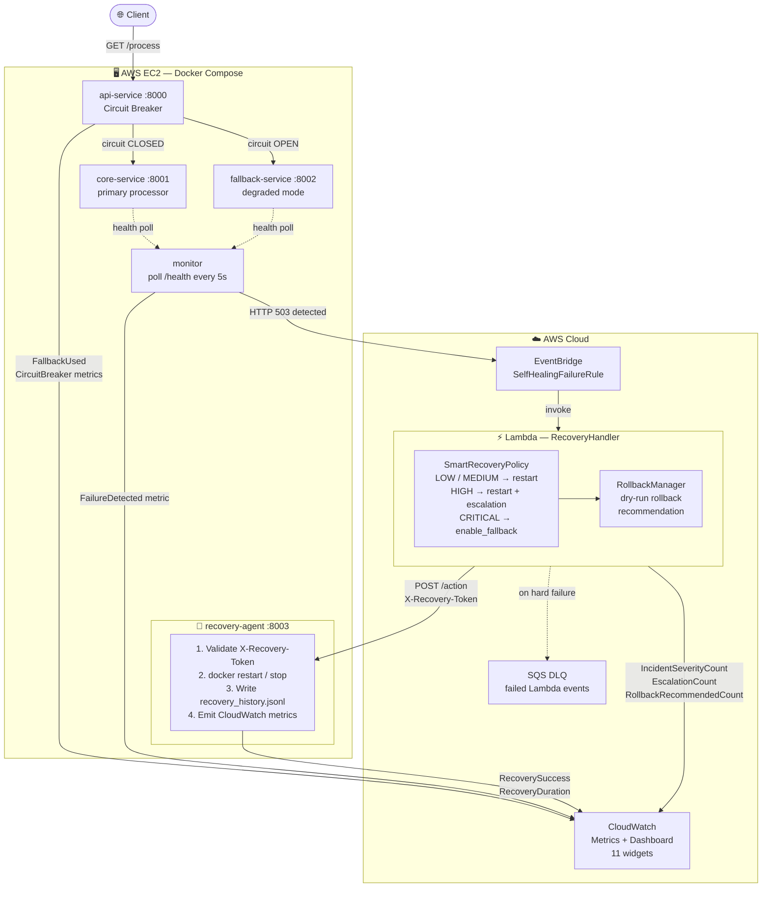

# Self-Healing Distributed System

> A production-grade distributed system that detects service failures, makes intelligent severity-aware recovery decisions through AWS Lambda, and restores full health — without human intervention.


---

## Table of Contents

- [Architecture Overview](#architecture-overview)
- [Phase Progression](#phase-progression)
- [Features](#features)
- [Tech Stack](#tech-stack)
- [System Workflow](#system-workflow)
- [Key Concepts](#key-concepts)
- [Project Structure](#project-structure)
- [Setup Instructions](#setup-instructions)
- [Testing the System](#testing-the-system)
- [CloudWatch Dashboard](#cloudwatch-dashboard)
- [Sample Outputs](#sample-outputs)
- [Future Improvements](#future-improvements)
- [Why This Project Matters](#why-this-project-matters)

---

## Architecture Overview



**End-to-end recovery time: ~5–30 seconds from crash detection to full health.**

---

## Phase Progression

This project was built incrementally across 6 phases, each adding a production-grade capability:

| Phase | What Was Built |
|---|---|
| **Phase 1** | Core microservices — api-service, core-service, fallback-service running in Docker Compose |
| **Phase 2** | Health monitor polling every 5s, detecting crashes and latency degradation |
| **Phase 3** | AWS EventBridge integration — monitor publishes failure events; Lambda receives and logs them |
| **Phase 4** | Lambda executes recovery — calls recovery-agent via HTTP to `docker restart` the failed container |
| **Phase 5** | Production hardening — circuit breaker, CloudWatch metrics, SQS DLQ, event cooldown, EC2 deployment |
| **Phase 6** | Advanced self-healing — SmartRecoveryPolicy, IncidentSeverity, escalation logic, RollbackManager, new CloudWatch widgets |

---

## Features

| Feature | Phase | Description |
|---|---|---|
| **Auto Recovery** | 4 | Lambda triggers `docker restart` on failed services. No manual intervention. |
| **Circuit Breaker** | 5 | Three-state machine (CLOSED → OPEN → HALF_OPEN). Stops hammering a failing service. |
| **Fallback Handling** | 5 | api-service routes traffic to fallback-service while core-service recovers. |
| **Event Cooldown** | 5 | 60s deduplication window prevents Lambda from firing multiple times per incident. |
| **Secure Recovery** | 5 | `X-Recovery-Token` header + service allowlist protect recovery-agent from unauthorized calls. |
| **CloudWatch Metrics** | 5 | 7 custom metrics across 3 services. Real-time failure and recovery visibility. |
| **Recovery Audit Log** | 5 | Every action appended to `recovery_history.jsonl` — permanent append-only log. |
| **SQS Dead-Letter Queue** | 5 | Failed Lambda invocations captured for post-incident analysis. |
| **EC2 Deployment** | 5 | All 4 Docker services deployed on AWS EC2, accessible over the internet. |
| **SmartRecoveryPolicy** | 6 | Decision engine mapping failure type + severity → correct recovery action. |
| **IncidentSeverity** | 6 | Four-tier classification: LOW / MEDIUM / HIGH / CRITICAL based on failure frequency. |
| **Escalation Logic** | 6 | Automatic escalation when failures exceed thresholds within sliding time windows. |
| **Action Override** | 6 | CRITICAL severity overrides restart → enable_fallback to stop the unstable container. |
| **RollbackManager** | 6 | Dry-run rollback recommendations logged when CRITICAL severity is reached. |
| **Severity Metrics** | 6 | Three new CloudWatch metrics: IncidentSeverityCount, EscalationCount, RollbackRecommendedCount. |

---

## Tech Stack

| Layer | Technology |
|---|---|
| **Services** | Python 3.12, FastAPI, uvicorn |
| **Packaging** | Docker, Docker Compose |
| **Health Monitor** | Python (requests, boto3) |
| **Event Bus** | AWS EventBridge |
| **Serverless Recovery** | AWS Lambda (Python 3.12) |
| **Decision Engine** | SmartRecoveryPolicy (custom, module-level state) |
| **Infrastructure** | AWS EC2 (t2.micro, Ubuntu 22.04) |
| **Dead-Letter Queue** | AWS SQS |
| **Observability** | AWS CloudWatch (custom metrics + 11-widget dashboard) |
| **Deployment** | AWS Systems Manager (SSM) send-command |
| **Configuration** | pydantic-settings (env-based) |
| **Testing** | pytest, 33-test suite (unit + integration) |

---

## System Workflow

### Normal Operation

```
Client ──► api-service ──► core-service ──► { "source": "core-service", "degraded": false }
```

### Failure → Auto-Recovery (8 steps)

```
Step 1   Client calls GET /process
         api-service tries core-service → returns 503 (crashed)

Step 2   Circuit Breaker opens after 3 consecutive failures
         api-service routes all traffic to fallback-service
         → { "source": "fallback-service", "degraded": true }

Step 3   Monitor detects HTTP 503 on core-service (5-second poll)
         Publishes event to AWS EventBridge:
         { "source": "selfhealing.monitor",
           "detail-type": "ServiceFailureDetected",
           "detail": { "service_name": "core-service", "failure_type": "crash" } }

Step 4   EventBridge rule matches → invokes Lambda
         Event cooldown prevents duplicate invocations for 60 seconds

Step 5   Lambda: SmartRecoveryPolicy evaluates severity
         failure_count_5min=1 → LOW  → action = restart_service
         failure_count_5min=3 → HIGH → action = restart_service (+ escalation)
         failure_count_10min≥5→ CRITICAL → action = enable_fallback (action override)

Step 6   Lambda calls POST /action on recovery-agent with:
         { "action": "restart_service", "target_service": "core-service",
           "severity": "LOW", "recovery_strategy": "standard_restart" }

Step 7   recovery-agent validates token + executes docker restart core-service
         Writes record to recovery_history.jsonl
         Emits CloudWatch metrics: RecoverySuccess, IncidentSeverityCount

Step 8   core-service restarts and passes health check
         Circuit breaker probes (HALF_OPEN) → success → CLOSED
         api-service resumes: { "source": "core-service", "degraded": false }
         Monitor clears cooldown. System fully healed.
```

### Circuit Breaker State Machine

```
          3 failures                  30s timer expires
CLOSED ─────────────────► OPEN ──────────────────────────► HALF_OPEN
  ▲                                                              │
  │              probe succeeds (1 request passes)              │
  └──────────────────────────────────────────────────────────────┘
                        probe fails → back to OPEN
```

### SmartRecoveryPolicy Decision Tree

```
Failure received
       │
       ├── failure_type = "slow"  ──────────────────────────► enable_fallback
       │                                                      (always, any severity)
       │
       └── failure_type = "crash" or "timeout"
                  │
                  ├── count_10min ≥ 5  → CRITICAL ──────────► enable_fallback
                  │                      is_escalated=True     (action override)
                  │
                  ├── count_5min  ≥ 3  → HIGH ───────────────► restart_service
                  │                      is_escalated=True     (+ escalation logged)
                  │
                  ├── count_5min  ≥ 2  → MEDIUM ─────────────► restart_service
                  │
                  └── count_5min  = 1  → LOW ───────────────► restart_service
```

---

## Key Concepts

### Circuit Breaker

A safety switch between api-service and core-service that prevents cascading failures.

- **CLOSED** — normal state. Every request passes through to core-service.
- **OPEN** — tripped after 3 consecutive failures. All requests bypass core-service and go directly to fallback-service. This gives core-service time to recover without being hammered.
- **HALF_OPEN** — after 30 seconds in OPEN, one test request is allowed through. If it succeeds, the circuit closes. If it fails, the circuit reopens for another 30 seconds.

This pattern is equivalent to Netflix Hystrix or Java's Resilience4j, implemented from scratch in Python.

### Fallback

When core-service is unavailable (circuit OPEN or HTTP 503), api-service calls fallback-service instead. The response indicates degraded mode:

```json
{ "source": "fallback-service", "degraded": true, "message": "Service temporarily unavailable" }
```

The client always gets a response — never a 503 error — while the system heals in the background.

### Smart Recovery

The `SmartRecoveryPolicy` class inside Lambda replaces a static action map with severity-aware decision making. It uses module-level Python dicts that persist across warm Lambda invocations (no DynamoDB needed) to track failure history in 5-minute and 10-minute sliding windows.

```
1st crash in 5min  → LOW    → restart
2nd crash in 5min  → MEDIUM → restart
3rd crash in 5min  → HIGH   → restart + escalation alert
5th crash in 10min → CRITICAL → stop the container (enable_fallback)
```

At CRITICAL, the system recognizes that restarting a service that keeps crashing is futile — it stops the container and routes all traffic through fallback until a human (or future Phase 7 automation) intervenes.

### Rollback Manager

The `RollbackManager` class tracks the last-known-good image tag for each service. When severity reaches CRITICAL, it logs a `ROLLBACK_RECOMMENDED` event with the image reference:

```
ROLLBACK_RECOMMENDED: service=core-service  image=core-service:latest  (Phase 6 dry-run)
```

This is Phase 6 dry-run — the recommendation is logged but not executed. Phase 7 would implement the actual `docker pull` + container replacement. The CloudWatch `RollbackRecommendedCount` metric makes this visible in the dashboard.

---

## Project Structure

```
self-healing-system/
│
├── api-service/                       # Entry point for client traffic (:8000)
│   └── app/
│       ├── services/
│       │   ├── api_service.py         # try core → fallback logic
│       │   └── circuit_breaker.py     # CLOSED/OPEN/HALF_OPEN state machine
│       └── publishers/
│           └── cloudwatch_publisher.py
│
├── core-service/                      # Primary business logic (:8001)
│   └── app/
│       ├── routes/core_routes.py      # GET /process, POST /fail, GET /health
│       └── services/state_manager.py  # crashed/healthy state
│
├── fallback-service/                  # Degraded-mode backup (:8002)
│
├── recovery-agent/                    # Executes Docker commands (:8003)
│   └── app/
│       ├── services/
│       │   ├── recovery_service.py    # restart / stop / start logic
│       │   └── recovery_history.py    # append-only JSONL audit log
│       ├── models/schemas.py          # ActionRequest with Phase 6 fields
│       └── publishers/
│           └── cloudwatch_publisher.py
│
├── monitor/                           # Health + latency monitor
│   └── app/
│       ├── checkers/
│       │   ├── health_checker.py      # HTTP /health polling every 5s
│       │   └── latency_checker.py     # SLOW / VERY_SLOW classification
│       ├── publishers/
│       │   ├── eventbridge_publisher.py
│       │   └── cloudwatch_publisher.py
│       └── services/
│           ├── monitor_service.py     # Main loop + cooldown logic
│           └── event_cooldown.py      # 60s deduplication window
│
├── aws/
│   ├── lambda/
│   │   ├── recovery_handler.py        # Lambda entry point (Phase 6)
│   │   ├── smart_recovery_policy.py   # IncidentSeverity + decision engine (Phase 6)
│   │   ├── rollback_manager.py        # Dry-run rollback recommendations (Phase 6)
│   │   └── tests/
│   │       ├── conftest.py
│   │       ├── test_smart_recovery_policy.py  # 18 unit tests
│   │       └── test_rollback_manager.py       # 15 unit tests
│   ├── cloudwatch/
│   │   ├── dashboard.json             # 11-widget CloudWatch dashboard
│   │   └── create_dashboard.sh
│   └── setup/
│       ├── eventbridge_rule.json
│       └── iam_policy.json
│
├── tests/
│   └── scripts/
│       ├── critical_core_failure_recovery.sh  # End-to-end chaos test
│       └── verify_cloudwatch_metrics.sh
│
├── docker-compose.yml
├── .env.example
└── docs/
    └── phase5-ec2-deployment.md
```

---

## Setup Instructions

### Prerequisites

| Tool | Version | Check |
|---|---|---|
| Docker + Docker Compose | v2+ | `docker compose version` |
| Python | 3.10+ | `python3 --version` |
| AWS CLI | v2 | `aws --version` |
| AWS account | — | Access key + secret configured |

### AWS Resources Required

| Resource | Name |
|---|---|
| Lambda Function | `SelfHealingRecoveryHandler` |
| Lambda IAM Role | Needs: `lambda:InvokeFunction`, `cloudwatch:PutMetricData` |
| EventBridge Rule | `SelfHealingFailureRule` |
| SQS Dead-Letter Queue | `SelfHealingLambdaDLQ` |
| CloudWatch Dashboard | `SelfHealingSystemDashboard` |
| EC2 Instance | Ubuntu 22.04, ports 8000–8003 open |

---

### Option A — Local (Docker Compose)

```bash
# 1. Clone
git clone https://github.com/agrawal-2005/self-healing-system.git
cd self-healing-system

# 2. Start all 4 services
docker compose up --build -d
docker compose ps   # all 4 should show (healthy)

# 3. Configure AWS credentials
cp .env.example monitor/.env
# Edit monitor/.env:
#   AWS_ACCESS_KEY_ID=...
#   AWS_SECRET_ACCESS_KEY=...
#   AWS_DEFAULT_REGION=us-east-1

# 4. Start the monitor
cd monitor
export $(grep -v '^#' .env | xargs)
python3 monitor.py > /tmp/monitor.log 2>&1 &
cd ..

# 5. Deploy Lambda (Phase 6 — all 3 files required)
cd aws/lambda
zip recovery_handler.zip recovery_handler.py smart_recovery_policy.py rollback_manager.py

aws lambda update-function-code \
  --function-name SelfHealingRecoveryHandler \
  --zip-file fileb://recovery_handler.zip \
  --region us-east-1

# 6. Configure Lambda environment
aws lambda update-function-configuration \
  --function-name SelfHealingRecoveryHandler \
  --environment "Variables={
    RECOVERY_AGENT_URL=http://<YOUR_EC2_OR_NGROK_URL>:8003,
    TARGET_SERVICE=core-service,
    RECOVERY_TOKEN=dev-token,
    MAX_RETRIES=3,
    IMAGE_TAG=latest,
    CLOUDWATCH_ENABLED=true,
    CLOUDWATCH_NAMESPACE=SelfHealingSystem
  }" \
  --region us-east-1

# 7. Grant Lambda permission to publish CloudWatch metrics
aws iam put-role-policy \
  --role-name <YOUR_LAMBDA_ROLE_NAME> \
  --policy-name AllowCloudWatchPutMetrics \
  --policy-document '{
    "Version":"2012-10-17",
    "Statement":[{"Effect":"Allow","Action":["cloudwatch:PutMetricData"],"Resource":"*"}]
  }'
```

---

### Option B — EC2 Deployment (Production)

All services run on an EC2 instance. Deployment uses AWS Systems Manager (SSM) — no SSH keys required.

```bash
# 1. Set your EC2 instance ID
INSTANCE_ID="i-xxxxxxxxxxxxxxxxx"
EC2="<your-ec2-public-ip>"

# 2. Deploy latest code via SSM
aws ssm send-command \
  --instance-ids "$INSTANCE_ID" \
  --document-name "AWS-RunShellScript" \
  --parameters 'commands=[
    "export HOME=/root",
    "git config --global --add safe.directory /home/ubuntu/self-healing-system",
    "cd /home/ubuntu/self-healing-system",
    "git pull origin main",
    "docker compose up --build -d --wait"
  ]' \
  --region us-east-1

# 3. Verify services are healthy
curl http://$EC2:8000/health    # api-service
curl http://$EC2:8001/health    # core-service
curl http://$EC2:8002/health    # fallback-service
curl http://$EC2:8003/health    # recovery-agent

# 4. Deploy Lambda pointing to EC2
aws lambda update-function-configuration \
  --function-name SelfHealingRecoveryHandler \
  --environment "Variables={
    RECOVERY_AGENT_URL=http://$EC2:8003,
    TARGET_SERVICE=core-service,
    RECOVERY_TOKEN=dev-token,
    MAX_RETRIES=3,
    IMAGE_TAG=latest,
    CLOUDWATCH_ENABLED=true,
    CLOUDWATCH_NAMESPACE=SelfHealingSystem
  }" \
  --region us-east-1
```

---

## Testing the System

### Unit Tests (Lambda — Phase 6)

```bash
cd aws/lambda
python -m pytest tests/ -v

# Expected output:
# tests/test_smart_recovery_policy.py::test_first_failure_is_low_severity PASSED
# tests/test_smart_recovery_policy.py::test_high_severity_escalation PASSED
# tests/test_smart_recovery_policy.py::test_critical_overrides_action_to_fallback PASSED
# tests/test_rollback_manager.py::test_recommend_rollback_on_critical PASSED
# ... 33 tests passed
```

### End-to-End Chaos Test

```bash
# Against local
chmod +x tests/scripts/critical_core_failure_recovery.sh
./tests/scripts/critical_core_failure_recovery.sh

# Against EC2
EC2=<your-ec2-ip> ./tests/scripts/critical_core_failure_recovery.sh
```

### Manual Tests

#### Test 1 — Verify baseline

```bash
curl http://$EC2:8000/process
# { "source": "core-service", "degraded": false }
```

#### Test 2 — Trigger a crash

```bash
curl -X POST http://$EC2:8001/fail
# { "crashed": true }
```

#### Test 3 — Observe fallback immediately

```bash
curl http://$EC2:8000/process
# { "source": "fallback-service", "degraded": true }
```

#### Test 4 — Observe recovery in monitor logs

```bash
# EC2 deployment
aws ssm send-command \
  --instance-ids "$INSTANCE_ID" \
  --document-name "AWS-RunShellScript" \
  --parameters 'commands=["docker logs monitor --tail 20"]'
```

#### Test 5 — Confirm full recovery

```bash
sleep 30
curl http://$EC2:8000/process
# { "source": "core-service", "degraded": false }
```

#### Test 6 — Phase 6 escalation demo (5 crashes, 65s apart)

```bash
EC2=<your-ec2-ip>
for i in 1 2 3 4 5; do
  curl -s -X POST http://$EC2:8001/fail
  echo "Crash $i triggered"
  sleep 65
done
# Crash 5 will trigger CRITICAL severity → enable_fallback + ROLLBACK_RECOMMENDED
```

---

## CloudWatch Dashboard

Dashboard name: `SelfHealingSystemDashboard`
Namespace: `SelfHealingSystem`

### All 11 Widgets Explained

#### Phase 5 Widgets

| Widget | Metric | What It Shows |
|---|---|---|
| **Failure Detected** | `FailureDetectedCount` | Each spike = one crash/timeout detected by monitor and sent to EventBridge. Dimension: `failure_type`. |
| **Recovery Outcomes** | `RecoverySuccessCount` / `RecoveryFailureCount` | Green = successful docker restart. Red = docker command failed. Ratio shows system reliability. |
| **Average Recovery Duration** | `RecoveryDurationMs` | Time in ms from Lambda invocation to docker command completing. Lower = faster healing. |
| **Fallback Used** | `FallbackUsedCount` | Each dot = one request that was served by fallback-service instead of core-service. |
| **Circuit Breaker Opened** | `CircuitBreakerOpenCount` | Each dot = circuit transitioned to OPEN. Frequent openings indicate persistent instability. |
| **Circuit Breaker State** | `CircuitBreakerState` | Gauge: 0=CLOSED (healthy), 1=HALF_OPEN (probing), 2=OPEN (all traffic on fallback). |
| **Lambda DLQ** | SQS `ApproximateNumberOfMessagesVisible` | Messages = Lambda hard-crashed. Zero = Lambda always handled events successfully. |

#### Phase 6 Widgets

| Widget | Metric | What It Shows |
|---|---|---|
| **Incident Severity Distribution** | `IncidentSeverityCount` | Stacked lines per severity tier (LOW/MEDIUM/HIGH/CRITICAL). Shows whether failures are isolated or a pattern. |
| **Escalation Count** | `EscalationCount` | Published only for HIGH and CRITICAL severity. Spikes here mean the system identified a persistent incident. |
| **Rollback Recommended** | `RollbackRecommendedCount` | Published only when CRITICAL + RollbackManager baseline exists. Each count = one rollback recommendation logged. |

### Custom Metrics Reference

| Metric | Emitted By | Dimensions |
|---|---|---|
| `FailureDetectedCount` | monitor | `ServiceName`, `FailureType` |
| `FallbackUsedCount` | api-service | `ServiceName` |
| `CircuitBreakerOpenCount` | api-service | `ServiceName` |
| `CircuitBreakerState` | api-service | `ServiceName` |
| `RecoverySuccessCount` | recovery-agent | `ServiceName`, `TargetService` |
| `RecoveryFailureCount` | recovery-agent | `ServiceName`, `TargetService` |
| `RecoveryDurationMs` | recovery-agent | `ServiceName`, `TargetService` |
| `IncidentSeverityCount` | Lambda | `ServiceName`, `TargetService`, `Severity` |
| `EscalationCount` | Lambda | `ServiceName`, `TargetService`, `Severity` |
| `RollbackRecommendedCount` | Lambda | `ServiceName`, `TargetService` |

### Suggested Alarms

```bash
# Alert if any recovery failure occurs
aws cloudwatch put-metric-alarm \
  --alarm-name "RecoveryFailed" \
  --namespace SelfHealingSystem \
  --metric-name RecoveryFailureCount \
  --statistic Sum --period 300 --threshold 1 \
  --comparison-operator GreaterThanOrEqualToThreshold \
  --evaluation-periods 1 \
  --alarm-actions <YOUR_SNS_ARN> \
  --region us-east-1

# Alert on CRITICAL escalation
aws cloudwatch put-metric-alarm \
  --alarm-name "CriticalEscalation" \
  --namespace SelfHealingSystem \
  --metric-name EscalationCount \
  --dimensions Name=Severity,Value=CRITICAL \
  --statistic Sum --period 300 --threshold 1 \
  --comparison-operator GreaterThanOrEqualToThreshold \
  --evaluation-periods 1 \
  --alarm-actions <YOUR_SNS_ARN> \
  --region us-east-1
```

---

## Sample Outputs

### Monitor log during a recovery cycle

```
2026-04-27 19:10:01 [monitor] INFO:    [OK]   api-service  status=UP   latency=6.7ms
2026-04-27 19:10:01 [monitor] WARNING: HealthChecker [core-service]: HTTP 503 (4ms)
2026-04-27 19:10:03 [monitor] INFO:    EventBridgePublisher: published event service=core-service failure=crash latency=13ms
2026-04-27 19:10:06 [monitor] INFO:    [DOWN] core-service status=DOWN latency=4.4ms
2026-04-27 19:10:11 [monitor] INFO:    EventCooldown: suppressing event service=core-service failure=crash (53s remaining)
2026-04-27 19:10:44 [monitor] INFO:    EventCooldown: cleared 1 timer(s) for 'core-service' on recovery
2026-04-27 19:10:44 [monitor] INFO:    [OK]   core-service status=UP   latency=11.0ms
2026-04-27 19:10:44 [monitor] INFO:    All 3/3 services healthy
```

### Lambda log — Phase 6 CRITICAL escalation

```
SmartRecoveryPolicy: action=enable_fallback  severity=CRITICAL  strategy=fallback_on_critical  count_5m=4  count_10m=5
ESCALATION: core-service failed 5x in 10 min — service is critically unstable — switching to enable_fallback
ROLLBACK_RECOMMENDED: service=core-service  image=core-service:latest  (Phase 6 dry-run)
lambda_handler: complete — success=True  severity=CRITICAL  duration=241ms  attempts=1  escalated=True  rollback=True
```

### recovery-agent log

```
2026-04-27 19:10:06 [recovery_service] INFO: RecoveryService: action=restart_service  target=core-service  severity=LOW
2026-04-27 19:10:06 [docker_executor]  INFO: DockerExecutor: running docker restart core-service
2026-04-27 19:10:07 [recovery_history] INFO: RecoveryHistory: recorded action=restart_service service=core-service success=True duration=520ms
```

### Recovery history record (`recovery_history.jsonl`)

```json
{
  "timestamp": "2026-04-27T19:10:06.361801+00:00",
  "service_name": "core-service",
  "failure_type": "crash",
  "action": "restart_service",
  "success": true,
  "message": "Container 'core-service' restarted successfully.",
  "recovery_duration_ms": 520.34,
  "returncode": 0,
  "severity": "LOW",
  "failure_count": 1,
  "recovery_strategy": "standard_restart",
  "escalation_reason": null
}
```

### Phase 6 CRITICAL record

```json
{
  "timestamp": "2026-04-27T19:15:44.892100+00:00",
  "service_name": "core-service",
  "failure_type": "crash",
  "action": "enable_fallback",
  "success": true,
  "message": "Container 'core-service' stopped successfully.",
  "recovery_duration_ms": 241.12,
  "returncode": 0,
  "severity": "CRITICAL",
  "failure_count": 5,
  "recovery_strategy": "fallback_on_critical",
  "escalation_reason": "ESCALATION: core-service failed 5x in 10 min — service is critically unstable"
}
```

### Circuit breaker log progression

```
WARNING: CircuitBreaker: failure recorded 1/3
WARNING: CircuitBreaker: failure recorded 2/3
WARNING: CircuitBreaker: CLOSED → OPEN (failures=3/3 threshold=3)
INFO:    FALLBACK_TRIGGERED: source=circuit_open
INFO:    CloudWatch: CircuitBreakerOpenCount+1  CircuitBreakerState=2
WARNING: CircuitBreaker: OPEN — blocking core-service call (29s until probe)
INFO:    CircuitBreaker: OPEN → HALF_OPEN after 30s cooldown
INFO:    CircuitBreaker: HALF_OPEN → CLOSED (core-service recovered)
INFO:    CloudWatch: CircuitBreakerState=0 (closed)
```

### api-service response — fallback active

```json
{ "source": "fallback-service", "degraded": true, "message": "Core service temporarily unavailable" }
```

### api-service response — fully recovered

```json
{ "source": "core-service", "degraded": false }
```

### Chaos test result

```
══════════════════════════════════════════════════════════════════
  TEST SUMMARY: critical_core_failure_recovery
══════════════════════════════════════════════════════════════════

  Total steps checked : 31
  Passed              : 31
  Failed              : 0

  ██████████████████████████████████████████
    RESULT: PASS — All steps completed
    Self-healing pipeline is working
  ██████████████████████████████████████████
```

---

## Future Improvements

| Improvement | Description |
|---|---|
| **ECS / Fargate deployment** | Replace Docker Compose with ECS tasks. Remove direct EC2 access — recovery-agent runs inside the same VPC as Lambda, eliminating token-over-HTTP security concerns. |
| **Auto rollback execution** | Phase 6 logs rollback recommendations (dry-run). Phase 7 would execute `docker pull` + container replacement when recovery fails after N retries. |
| **AI-based anomaly detection** | Replace threshold-based latency checks with a time-series model (e.g. AWS Lookout for Metrics) that detects statistical anomalies without fixed thresholds. |
| **Multi-region failover** | Replicate the EventBridge → Lambda → recovery pipeline across two regions. Promote secondary on primary failure. |
| **Slack / PagerDuty alerts** | Wire CloudWatch alarms → SNS → Lambda → Slack webhook. On-call engineers receive a message with recovery status and severity within seconds of detection. |
| **DynamoDB failure history** | Replace module-level in-memory failure tracking with DynamoDB for persistence across cold Lambda starts and multi-Lambda deployments. |
| **Recovery runbooks** | Store runbooks in S3. Lambda fetches and executes the correct runbook for each `failure_type`, enabling service-specific recovery procedures. |
| **Chaos engineering suite** | Extend with slow-response, OOM, and partial-failure scenarios using `tc` (traffic control) or Pumba for realistic fault injection. |

---

## Why This Project Matters

Modern distributed systems fail. Databases go down, pods crash, deployments introduce regressions. The standard response is human: an on-call engineer wakes up at 3 AM, reads logs, and runs `kubectl rollout restart`. That loop takes minutes.

This project compresses that loop to seconds — and makes the decisions smarter.

The architecture mirrors patterns used in production at large-scale engineering organizations:

- **Netflix Hystrix / Resilience4j** — circuit breakers protecting service meshes from cascading failures
- **AWS Auto Scaling** — health-check-driven replacement of unhealthy instances
- **Kubernetes liveness probes + restart policies** — container-level automatic recovery
- **PagerDuty + runbook automation** — event-driven remediation without human toil
- **Progressive severity escalation** — the same pattern used by major incident management platforms (PagerDuty, OpsGenie) to route alerts to the right responder at the right urgency level

The difference is that this system is fully observable, fully tested, and demonstrates these patterns end-to-end in a real AWS environment. Every component — the circuit breaker state machine, the event cooldown, the severity-based decision engine, the token-authenticated recovery agent, the CloudWatch dashboard — is a simplified but structurally faithful implementation of what runs in real production infrastructure.

For an SRE or DevOps engineer, this is a working demonstration of **toil reduction**: turning reactive firefighting into proactive, automated, and escalation-aware recovery.

---

## Author

**Prashant Agrawal**

[](https://github.com/agrawal-2005)

---

## License

This project is licensed under the **MIT License** — see the [LICENSE](LICENSE) file for details.

---

<p align="center">Star this repo if it helped you understand self-healing infrastructure patterns.</p>

<p align="center">Built to demonstrate production-grade SRE patterns: circuit breaking, intelligent escalation, and automated recovery.</p>
